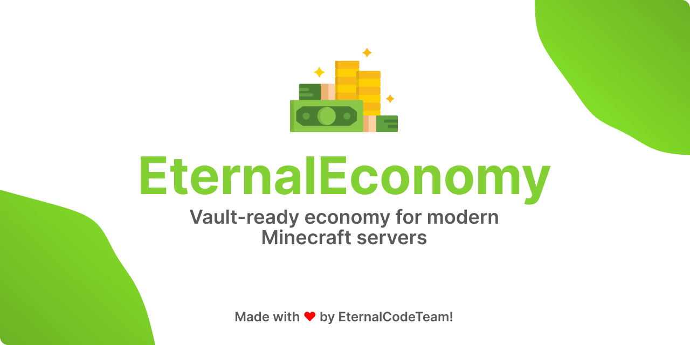

 

[Report Bug](https://github.com/EternalCodeTeam/EternalEconomy/issues) • [Request Feature](https://github.com/EternalCodeTeam/EternalEconomy/issues) • [Join Discord](https://discord.com/invite/FQ7jmGBd6c)

 

# EternalEconomy

> Modern economy plugin for Paper servers: balances, payments, banknotes, leaderboards and Vault integration in one clean package.

## Highlights

| Feature | What it gives you |
| --- | --- |
| Vault provider | Works as the server economy provider for plugins that use Vault. |
| Player economy | Balance checks, transfers and configurable starting balance. |
| Admin tools | Add, remove, set, reset and inspect player balances. |
| Banknotes | Players can withdraw money into redeemable items with custom material, lore, glow and thresholds. |
| Leaderboard | Cached balance ranking with chat pages or configurable GUI. |
| PlaceholderAPI | Exposes balance placeholders for scoreboards, TAB and other PAPI consumers. |
| Storage | SQLite by default, with H2, MySQL, MariaDB and PostgreSQL support. |
| Folia-ready | Marked as Folia supported  |

> [!IMPORTANT]
> EternalEconomy requires **Vault**. PlaceholderAPI is optional, but enabled automatically when present.

## Requirements

| Requirement | Version / note |
| --- | --- |
| Server | Paper `1.19+` |
| Java | `17+` runtime |
| Required plugin | `Vault` |
| Optional plugin | `PlaceholderAPI` |

## Commands

| Command | Aliases | Permission | Description |
| --- | --- | --- | --- |
| `/balance` | `/bal`, `/money` | `eternaleconomy.player.balance` | Shows your balance. |
| `/balance <player>` | `/bal <player>`, `/money <player>` | `eternaleconomy.player.balance.other` / `eternaleconomy.admin.balance` | Shows another player's balance. |
| `/pay <player> <amount>` | `/transfer` | `eternaleconomy.player.pay` | Sends money to another player. |
| `/withdraw <amount>` | - | `eternaleconomy.player.withdraw` | Converts balance into a redeemable banknote item. |
| `/balancetop [page]` | `/baltop`, `/btgui`, `/topgui` | `eternaleconomy.player.balance.top` | Opens or prints the balance leaderboard. |
| `/economy add <player> <amount>` | `/eco add` | `eternaleconomy.admin.add` | Adds money to a player. |
| `/economy remove <player> <amount>` | `/eco remove` | `eternaleconomy.admin.remove` | Removes money from a player. |
| `/economy set <player> <amount>` | `/eco set` | `eternaleconomy.admin.set` | Sets a player's balance. |
| `/economy set <player> 0` | `/eco set <player> 0` | `eternaleconomy.admin.set` | Sets a player's balance to zero. |
| `/economy reset <player>` | `/eco reset` | `eternaleconomy.admin.reset` | Resets balance to the configured default. |
| `/economy reload` | - | `eternaleconomy.admin.reload` | Reloads plugin configuration. |

## Permissions

| Permission | Access |
| --- | --- |
| `eternaleconomy.player.balance` | Own balance command. |
| `eternaleconomy.player.balance.other` | Other-player balance lookup. |
| `eternaleconomy.player.pay` | Player-to-player payments. |
| `eternaleconomy.player.balance.top` | Balance leaderboard. |
| `eternaleconomy.player.withdraw` | Banknote withdrawals. |
| `eternaleconomy.admin.balance` | Admin balance lookup. |
| `eternaleconomy.admin.add` | Add balance. |
| `eternaleconomy.admin.remove` | Remove balance. |
| `eternaleconomy.admin.set` | Set balance. |
| `eternaleconomy.admin.reset` | Reset balance. |
| `eternaleconomy.admin.reload` | Reload configuration. |

## PlaceholderAPI

| Placeholder | Output |
| --- | --- |
| `%eternaleconomy_balance%` | Player balance formatted by EternalEconomy. |
| `%eternaleconomy_balance_formatted%` | Same formatted balance output. |
